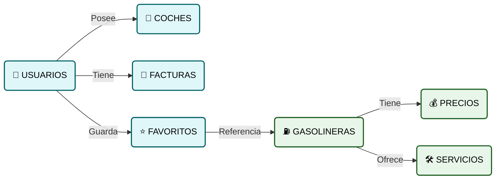

# MyGasolinera Backend 🚗⛽

**Backend API REST para la aplicación MyGasolinera** - Sistema de gestión de gasolineras, precios de combustible y vehículos personales.

---

## 👥 Equipo de Desarrollo

Desarrollado por:
- **Oscar**
- **Cristian**
- **David**
- **Carlos**

---

## 📋 Descripción

MyGasolinera Backend es una **API REST** desarrollada con Node.js y Express que proporciona servicios de autenticación, gestión de usuarios, vehículos y gasolineras. 

El sistema ha sido modernizado para incluir **acceso remoto seguro** mediante Cloudflare Tunnel, **sincronización automática de precios** con el Ministerio de Transición Ecológica, y **descubrimiento dinámico de URL** mediante GitHub Gists.

> **Nota:** Este es el repositorio del **Backend**. La aplicación móvil Flutter se encuentra en un repositorio separado.

### ✨ Características Principales

- 🔐 **Autenticación segura** con JWT y bcrypt
- 👤 **Gestión de usuarios** (registro, login, recuperación de contraseña por email)
- 🚙 **Gestión de vehículos** por usuario
- ⛽ **Sistema de gasolineras** con sincronización automática de precios
- 🌐 **Acceso Remoto Automático** via Cloudflare Tunnel
- 🔄 **URL Dinámica** compartida via GitHub Gist para el frontend
- ⭐ **Favoritos** para guardar gasolineras preferidas
- 🧾 **Gestión de facturas** con subida de imágenes (Multer)
- 🔒 **Middleware de autenticación** para rutas protegidas

---

## 🛠️ Tecnologías y Frameworks

Stack tecnológico del proyecto:

| Tecnología | Versión | Propósito |
|------------|---------|-----------|
| **Node.js** | - | Motor para ejecutar el backend |
| **Express** | ^4.21.2 | Framework para crear la API |
| **MariaDB** | 12.0.2+ | Base de datos principal |
| **mysql2** | ^3.15.3 | Conector con la base de datos |
| **bcryptjs** | ^2.4.3 | Encriptar contraseñas de usuarios |
| **jsonwebtoken** | ^9.0.2 | Autenticación segura y rápida |
| **nodemailer** | ^7.0.11 | Enviar correos de recuperación |
| **multer** | ^2.0.2 | Subir imágenes de facturas |
| **axios** | ^1.5.0 | Peticiones a APIs externas |
| **cloudflared** | - | Acceso remoto sin abrir puertos |

---

## 📦 Instalación y Configuración

### Prerrequisitos

- **Node.js** (v14 o superior)
- **MariaDB** (v12.0.2 o superior)
- **Cloudflared** (instalado y en el PATH del sistema)
- **Cuenta de GitHub** (para integración con Gist)
- **Servidor SMTP** (para recuperación de contraseñas)

### Pasos de Instalación

1. **Clonar el repositorio**
   ```bash
   git clone <repository-url>
   cd BackendBBDD
   ```

2. **Instalar dependencias**
   ```bash
   npm install
   ```

3. **Configurar variables de entorno (.env)**
   
   Crear un archivo `.env` en la raíz con la siguiente configuración:

   ```env
   # Base de Datos
   DB_USER=root
   DB_HOST=127.0.0.1
   DB_NAME=mygasolinera
   DB_PASSWORD=
   DB_PORT=3306

   # Servidor
   PORT=3000
   NODE_ENV=development

   # Seguridad
   JWT_SECRET=MyGasolineraSecretKey

   # GitHub Gist (Para compartir URL pública)
   GITHUB_TOKEN=ghp_xxxxxxxxxxxxxxxxxxxx
   GIST_ID=xxxxxxxxxxxxxxxxxxxxxxxxxxxx # Se autogenera si no existe

   # Email (Recuperación de contraseñas)
   EMAIL_HOST=smtp.mailtrap.io
   EMAIL_PORT=2525
   EMAIL_USER=tu_usuario
   EMAIL_PASS=tu_password
   ```

4. **Crear la base de datos**
   
   Usar importar `crear_bbdd/mygasolinera.sql` en tu gestor de base de datos favorito.

---

## 🚀 Scripts y Ejecución

El proyecto incluye scripts avanzados para facilitar el desarrollo y despliegue local accesible públicamente.

### 1. Iniciar con Tunneling (Recomendado)
Este script inicia el servidor, levanta un túnel de Cloudflare, y actualiza automáticamente un Gist privado con la nueva URL pública. Esto permite que la APP móvil siempre sepa a dónde conectarse.

```bash
npm run start:tunnel
```

**Flujo:**
1. Inicia Express en puerto local (3000).
2. Inicia Cloudflared Tunnel apuntando al puerto 3000.
3. Obtiene la URL pública (`https://....trycloudflare.com`).
4. Actualiza el Gist de GitHub con esta URL.

### 2. Sincronizar Gasolineras
Descarga los precios actualizados de todas las gasolineras de España desde la API del Ministerio y actualiza la base de datos local.

```bash
npm run sinc-gasolineras
```

### 3. Otros Comandos

| Comando | Descripción |
|---------|-------------|
| `npm start` | Inicia solo el servidor Express (local) |
| `npm run dev` | Inicia servidor en modo desarrollo (watch) |
| `npm run start-with-sync` | Sincroniza gasolineras y luego inicia el servidor |

---

## 📊 Estructura de la Base de Datos


```mermaid
graph LR
    %% Clases de Estilo (Colores)
    classDef usuarioStyle fill:#e0f7fa,stroke:#006064,stroke-width:2px,color:#000
    classDef datoStyle fill:#e8f5e9,stroke:#1b5e20,stroke-width:2px,color:#000
    classDef relacionStyle stroke:#999,stroke-width:1px,stroke-dasharray: 5 5

    %% Nodos (Tablas)
    User(👤 USUARIOS):::usuarioStyle
    Car(🚙 COCHES):::usuarioStyle
    Bill(🧾 FACTURAS):::usuarioStyle
    Fav(⭐ FAVORITOS):::usuarioStyle

    Gas(⛽ GASOLINERAS):::datoStyle
    Price(💰 PRECIOS):::datoStyle
    Serv(🛠️ SERVICIOS):::datoStyle

    %% Relaciones
    User -->|Posee| Car
    User -->|Tiene| Bill
    User -->|Guarda| Fav
    
    Fav -->|Referencia| Gas
    Gas -->|Tiene| Price
    Gas -->|Ofrece| Serv
```

---

## 🔌 API Endpoints Principales

### 🔐 Autenticación y Usuario
- `POST /register`: Registro de nuevos usuarios.
- `POST /login`: Inicio de sesión (Retorna JWT).
- `POST /forgot-password`: Solicitar email de recuperación.
- `GET /profile`: Obtener datos del usuario actual.

### ⛽ Gasolineras
- `GET /gasolineras`: Listado de gasolineras (soporta filtros).
- `GET /gasolineras/cercanas`: Buscar por lat/long.

### 🚙 Vehículos
- `GET /coches`: Listar vehículos del usuario.
- `POST /insertCar`: Añadir nuevo vehículo.
- `DELETE /coches/:id`: Eliminar vehículo.

### 🧾 Facturas
- `POST /facturas`: Subir nueva factura (con imagen).
- `GET /facturas`: Listar facturas del usuario.

---

##  Solución de Problemas Comunes

### Error de "Cloudflared no encontrado"
Asegúrate de haber instalado `cloudflared` y que esté accesible en la terminal (PATH). En Windows, puedes instalarlo con `winget install Cloudflare.cloudflared`.

### Error actualizando Gist
Verifica que tu `GITHUB_TOKEN` tenga permisos de **"gists"**. Si es la primera vez, deja `GIST_ID` vacío en el `.env` y el script creará uno nuevo y guardará su ID.

### No se envían correos
Revisa la configuración SMTP en `.env`. Para desarrollo, se recomienda usar **Mailtrap**.

---

## 📄 Licencia

Este proyecto está bajo la licencia **MIT**.

<div align="center">
  <b>MyGasolinera Backend</b> - 2025
</div>
